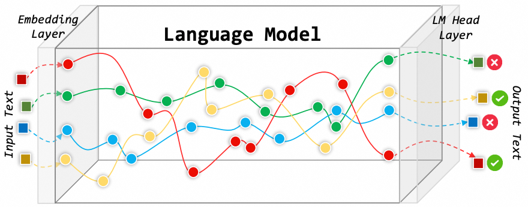
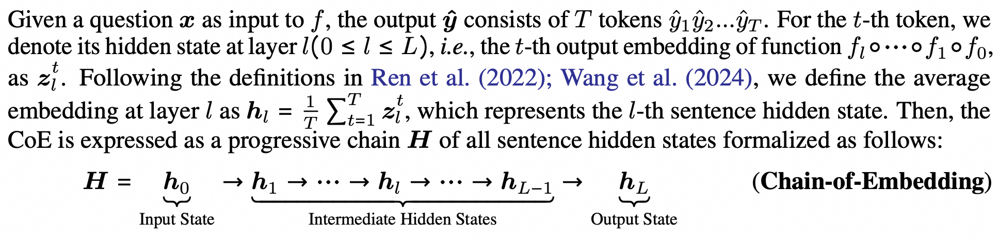
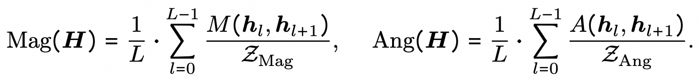
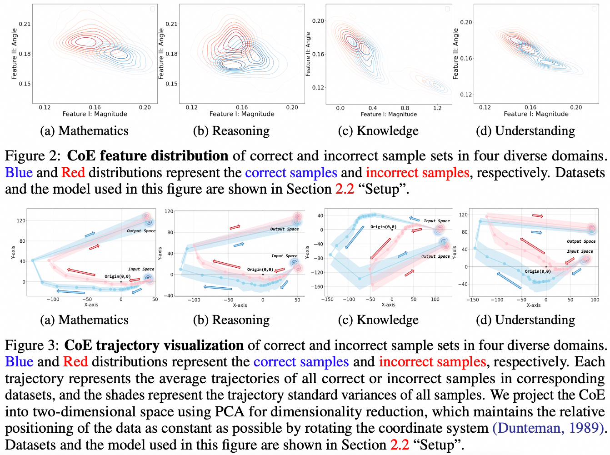

## <center> </img> Latent Space Chain-of-Embedding Enables Output-free LLM Self-Evaluation</center>


$\boxed{\text{Chain-of-Embedding (CoE)}}$ is a brand-new interpretability tool, which **captures a progressive embedding chain from input to output space** by tracking the hidden states of language models during inference.

<div align=center>
</img>
</div>

***Definition***:
<div align=center>
</img>
</div>

***Two CoE Features***:
<div align=center>
</img>
</div>

***Insight***: When the language model responds correctly and incorrectly, the CoE in the latent space will produce differentiated representations.
<div align=center>
</img>
</div>


---

## *Usage Instruction*

We provide automated scripts in this repository to help you obtain inference-time **CoE scores** and **Visualization** of each sample.

## Preparation


### 1. Model

To prevent instability in remote access, our code uses local model loading. You need to download the model you need to deploy (e.g., Llama-3-8B-Instruct) into the ``Model`` folder and add the name of the model folder to ``MODEL_POOL`` in ``config_pool.py``.

``Model/``

```sh
Model
  └── Llama-3-8B-Instruct ### add
      ├── config.json
      ├── model-00001-...
      ├── tokenizer_config.json
      └── ...
```

``config_pool.py``

```py
MODEL_POOL = [
        "Llama-3-8B-Instruct", ### add
    ]
```

*Note*: Our work is primarily focused on the **zero-shot paradigm for instruct-based models**. If using a base model, it may need to be modified to a few-shot paradigm.


### 2. Dataset

You need to add the dataset (``.jsonl`` format) to be tested into the ``Data`` folder (e.g. math).

``Data/``

```sh
Model
  └── math.jsonl ### add
```

Each sample must contain **at least the following keys and values**:

```py
{
  "id": 1, ### Unique identifier
  "en": "Find the units digit of $29 \\cdot 79 + 31 \\cdot 81$.", ### Question described in English
  "answer": "2" ### Standard answer without solution process
}
```

Similarly, please add the dataset name to ``DATASET_POOL`` in ``config_pool.py``.

``config_pool.py``

```py
DATASET_POOL = [
        "math", ### add
    ]
```

We also provide a multilingual interface. If you need to infer a multilingual version of a dataset, please first add the desired language list to ``LANGUAGE_MAPPING`` in ``config_pool.py``, and add question descriptions in the dataset file using the language names as keywords (refer to the mgsm dataset).

### 3. Instruction

The instructions corresponding to different datasets are stored under ``DATASET_PROMPTS`` in ``prompt_pool.py``. We provide instructions for all the datasets used in the paper, with some of them referencing <https://github.com/openai/simple-evals> and <https://github.com/open-compass/opencompass>.

``prompt_pool.py``

```py
DATASET_PROMPTS = {
    "mgsm": "Solve this math problem. Give the reasoning steps before giving the final answer on the last line by itself in the format of \"Answer:\". Do not add anything other than the integer answer after \"Answer:\".\n\nQuestion:\n{input_data}\n", ### add
}
```

*Note*: Please use **string parsing format** to facilitate automated parsing of input questions.

## Inference

```sh
bash Scripts/llm_infer.sh
```

Your can modify the following parameters in this script:

```sh
#!/bin/bash

export PROJECT_PATH="your/path/to/Chain-of-Embedding" ### your local path
export CUDA_VISIBLE_DEVICES="0,1" ### cuda id

model_name="qwen2-7B-Instruct" ### model name
dataset_list=(mgsm) ### dataset name (We provide a mode for cyclic testing across multiple datasets.)

for i in ${dataset_list[*]}; do
    python main.py --model_name $model_name \
                    --dataset "$i" \
                    ### The following are optional:
                    --print_model_parameter \
                    --save_output \
                    --save_hidden_states \
                    --save_coe_score \
                    --save_coe_figure
done
```

### Optional Parameters:

```print_model_parameter```: As described

```--save_output```: Save output (text sequence, perplexity, etc.) of each sample to ```./OutputInfo/{language}/Output/{model}/{dataset}/{dataset}_{sample_id}.pkl```

```--save_hidden_states```: Save hidden states corresponding to each output token at each layer of each sample to ```./OutputInfo/{language}/HiddenStates/{model}/{dataset}/{dataset}_{sample_id}.pkl```

```--save_coe_score```: Save CoE Score of each sample to ```./OutputInfo/{language}/CoE/{model}/{dataset}/{dataset}_{sample_id}.pkl```

```--save_coe_figure```: Draw the CoE trajectory of each sample to ```./Figure/{language}/{model}/{dataset}/{dataset}_{sample_id}.pkl```

### Core CoE Score Computation

In ```score.py```.

## Citation

If you use our technique or are inspired by our work, welcome to cite our paper and provide valuable suggestions.

```
@article{wang2024latent,
  title={Latent Space Chain-of-Embedding Enables Output-free LLM Self-Evaluation},
  author={Wang, Yiming and Zhang, Pei and Yang, Baosong and Wong, Derek F and Wang, Rui},
  journal={arXiv preprint arXiv:2410.13640},
  year={2024}
}
```
